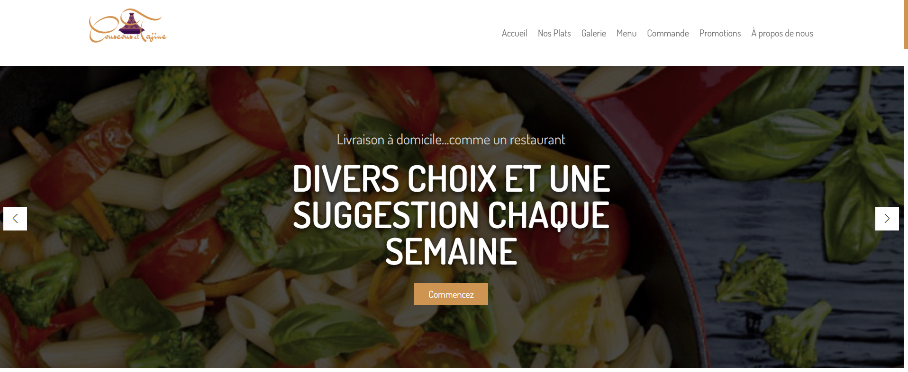
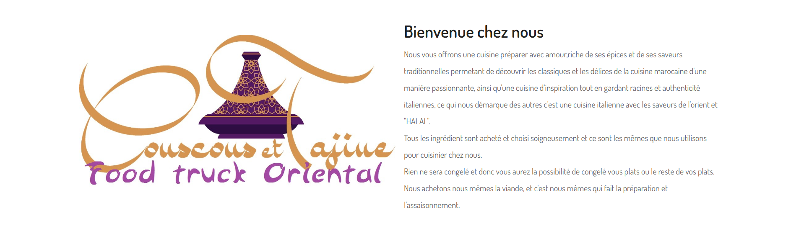
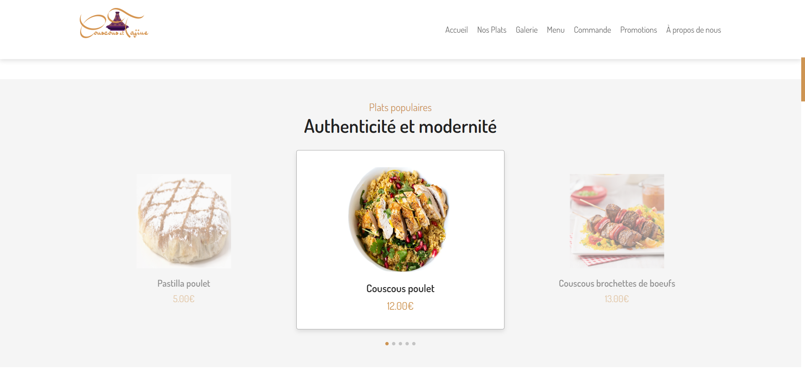
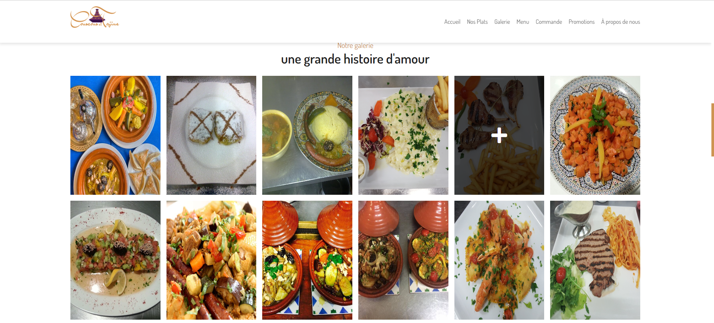
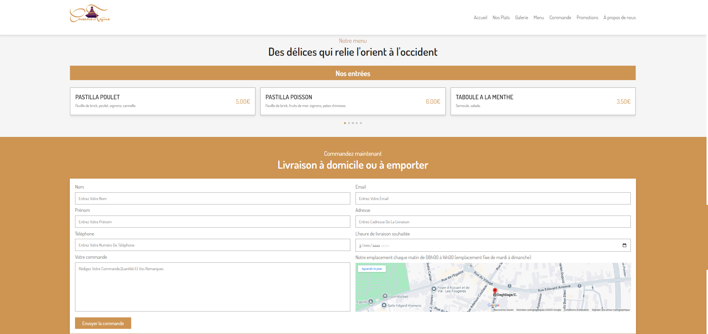
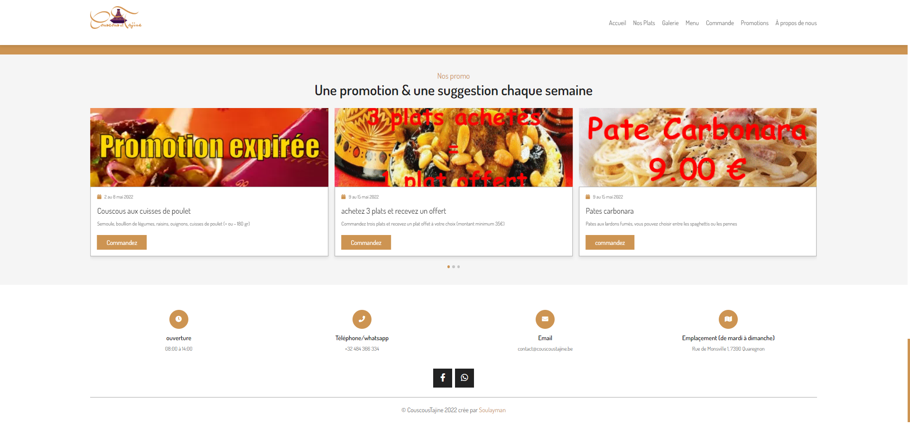

# Couscoustajine – Site web d'examen

Ce dépôt contient le site web **Couscoustajine**, réalisé dans le cadre de l'**UE Design Web** (Bachelier en Informatique de Gestion).

C'est un site vitrine pour un restaurant de cuisine marocaine (couscous, tajines, pâtisseries…), que j'ai développé en HTML/CSS/JS + un peu de PHP pour le formulaire de contact.

---

## Objectif du projet

- Mettre en place un **site complet** pour un faux restaurant
- Travailler la **structure HTML**, le **design en CSS** et un peu d’**interactivité en JavaScript**
- Gérer un **formulaire de contact** côté client + côté serveur (PHP)
- Respecter les consignes de l’examen (organisation des dossiers, code propre, etc.)

---

## Technologies utilisées

- **HTML5** pour la structure des pages  
- **CSS3** (flexbox, responsive, hover, etc.)  
- **JavaScript** pour :
  - le menu burger
  - les sliders (via **Swiper.js**)
  - l’ouverture des previews (plats, etc.)
- **PHP** pour le traitement du formulaire de contact  
- **Assets** :
  - images (plats, ambiance)
  - audio (musique de fond)
  - quelques icônes (font-awesome / équivalent)

Arborescence du projet :

- `index.html`
- `css/` --> styles du site
- `js/` --> scripts (menu, sliders, previews…)
- `images/` --> toutes les images du site
- `audio/` --> fichier audio d'ambiance
- `php/` --> traitement du formulaire (ex: `contact.php`)
- `Archive/` --> versions ou fichiers gardés de côté

---

## Fonctionnalités principales

- **Page d'accueil** avec slider et mise en avant du restaurant  
- **Section plats / menu** avec présentation des spécialités  
- **Prévisualisation des plats** (popup quand on clique sur un plat)  
- **Formulaire de contact** (PHP) pour envoyer un message au restaurant  
- **Design responsive** pour que le site reste lisible sur PC, tablette et mobile  
- **Ambiance visuelle et sonore** (images + audio) pour plonger l’utilisateur dans l’univers du restaurant

---

## Comment tester le projet en local

Comme il y a du PHP, l’idéal est d’utiliser un petit serveur local :

1. il fau installer **XAMPP** ou **WAMP** ou autre serveur local
2. Mettre le dossier du projet dans :
   - `htdocs` (XAMPP)  
   - ou `www` (WAMP)
3. Lancer Apache
4. Ouvrir dans le navigateur :

```text
http://localhost/couscoustajine-website/

---

## Aperçu du site (captures d’écran)

Pour donner un aperçu visuel du projet, voici quelques captures d’écran des différentes sections du site :

### Page d’accueil


### Section "À propos / Bienvenue"


### Plats populaires


### Galerie photos


### Formulaire de commande


### Page Promotions


